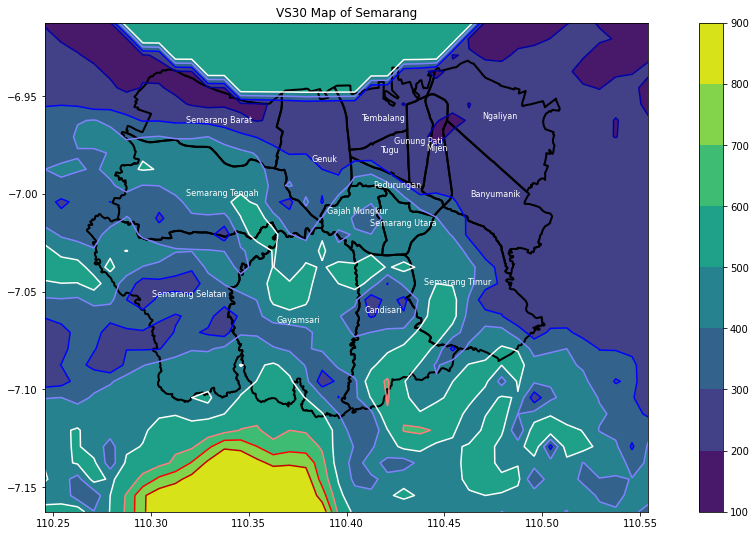

# USGS VS30 Map Visualization

## Introduction
The objetive of this project was to visiualize a USGS VS30 Map visualization of Semarang, ID using Matplotlib &amp; Plotly.

## Method
Rasterio & Geopandas were use to read the geotiff and geojson files which contains sub-district (Kecamatan) boundary data.

## Results

### Matplotlib

### Plotly
